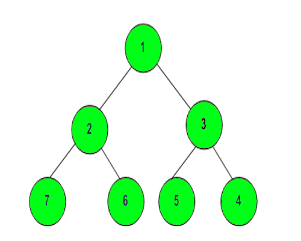

# Practise Questions

## 1. Check whether 2 strings are anagrams or not.
```python
strings = input().split()
if "".join(sorted(strings[0])) == "".join(sorted(strings[1])):
   print('Anagrams')
else:
  print('No Anangrams')
```
## 2. Check whether 2 strings are palindrome or not.
```python
s = input()
if s == s[-1::-1]:
  print('Palindrome')
else:
  print('Not a Palindrome')
```
## 3. Remove all consecutive duplicates from a given string.
```python
s = input()
l = []
for i in range(len(s)-1):
    if s[i]!=s[i+1]:
        l.append(s[i])
if s[-2] != s[-1]:
    l.append(s[-1])
print("".join(l))
```
## 4. Return the second most repeated character from the string.
```python
s = input()
d = dict()
for i in s:
    if i in d:
        d[i] +=1
    else:
        d[i] = 1
l = sorted(d.items(), key= lambda x:(x[1],x[0]))
print(l[-1][0])
```
## 5. Return common characters of two strings in alphabetical order.
```python
s1,s2 = input().split()
l = []
for i in s1:
    if i in s2:
        l.append(i)
print(l)
```
## 6. Add two bit strings.
```python
s1,s2 = input().split()
x = int(s1,2)+int(s2,2)
print('Decimal Equivalent :',x)
ans = str(bin(x))
ans = ans[2:]
print('Binary Equivalent :',ans)
```
## 7. Given a string, find the longest length of a prefix which is also a suffix.
**Hint :** This question refers to the computelps method of KMP String Matching Algorithm. See GeeksforGeeks for details.
```python
p = input()
m = len(p)
l = [0 for i in range(m)]
maxlen = 0
i = 1
while i < m:
    if p[i] == p[maxlen]:
        maxlen += 1
        l[i] = maxlen
        i += 1
    else:
        if maxlen != 0:
            maxlen = l[maxlen - 1]
        else:
            l[i] = 0
            i += 1
print(l)
```
## 8. KMP Pattern Matching Algorithm
```python
def KMPsearch(s,p):
    i = 0
    j = 0
    m = len(p)
    n = len(s)
    l = computeLPS(p)
    while i < n:
        if s[i] == p[j]:
            i += 1
            j += 1
        if j == m:
            print('Pattern found at index '+ str(i-j))
            j = l[j-1]
        elif i < n and p[j] != s[i]:
            if j != 0:
                j = l[j-1]
            else:
                i += 1
def computeLPS(p):
    m = len(p)
    l = [0 for i in range(m)]
    maxlen = 0
    i = 1
    while i < m:
        if p[i] == p[maxlen]:
            maxlen += 1
            l[i] = maxlen
            i += 1
        else:
            if maxlen != 0:
                maxlen = l[maxlen - 1]
            else:
                l[i] = 0
                i += 1
    return l;
KMPsearch('ABABDABACDABABCABAB','ABABCABAB')
```
## 9. Given a string of brackets (, ), {, }, [, ], find the position in the string where the orders of brackets breaks.
```python
s = input()
l = []
flag = -1
for ind , i in enumerate(s):
    if i =='(' or i == '{' or i == '[':
        l.append((i,ind))
    else:
        try:
            if ( i == ')' and l[-1][0] == '(') or (i == '}' and l[-1][0] == '{') or (i == ']' and l[-1][0] == '['):
                del l[-1]
            else:
                flag = ind
        except:
            flag = ind
if len(l) == 1 and (l[0][0] == '(' or l[0][0] == '{' or l[0][0] == '['):
    flag = l[0][1]
if flag != -1:
    print(flag+1)
else:
    print(flag)
```
## 10. Given a list of string and numbers, rotate the string by one position to the right if the sum of squares of digits of the corresponding number is even and rotate it twice to the left if the sum of the squares of the digits of the corresponding number is odd.
```python
l1= input().split(' ')
l2 = list(map(int,input().split(' ')))
def sumsquares(n):
    sum = 0
    while n > 0:
        sum += (n % 10)**2
        n = n //10
    return sum
ans = []
for x,y in zip(l1,l2):
    if sumsquares(y)%2 == 0:
        x = x[-1]+x[:-1]
    else:
        x = x[2:]+x[:2]
    ans.append(x)
print(ans)
```
## 11. Given an alphanumeric string, extract all numbers, remove the duplicate digits, and from that set of digits construct the largest even number possible
```python
def extractnumbers(s):
    ans = ''
    for i in s:
        if i.isalpha() == False:
            ans += i
    return ans
s = extractnumbers(input())
s = ''.join(dict.fromkeys(s))
s = sorted(s,reverse=True)
if int(s[-1])%2 != 0:
    for i in range(len(s)-2,0,-1):
        if int(s[i])%2 ==0:
            x = s[-1]
            s[-1] = s[i]
            s[i] = x
            break
print(''.join(s))
```
## 12. Find the length of largest subarray with 0 sum.
```python
def maxLen(n, lis):
    d = {}
    sum = 0
    maxl = 0
    for i in range(len(lis)):
        sum += lis[i]
        if lis[i] == 0 and maxl == 0:
            maxl = 1
        if sum == 0:
            maxl = i+1
        if sum in d:
            maxl = max(maxl,i - d[sum])
        else:
            d[sum] = i
    return maxl
```
## 13. Largest subarray of 0's and 1's.
```python
def maxLen(n, lis):
    for i in range(len(lis)):
        if lis[i] == 0:
            lis[i] = -1
    d = {}
    sum = 0
    maxl = 0
    for i in range(len(lis)):
        sum += lis[i]
        if lis[i] == 0 and maxl == 0:
            maxl = 1
        if sum == 0:
            maxl = i+1
        if sum in d:
            maxl = max(maxl,i - d[sum])
        else:
            d[sum] = i
    return maxl
```
## 14. Subarray with given sum .
```python
t = int(input())
for _ in range(t):
    n, s = list(map(int,input().split()))
    l = list(map(int,input().split()))
    #using sliding window approach
    start = 0
    last = 0
    sum = 0
    flag = 0
    for i in range(len(l)):
        sum += l[i]
        last = i+1
        if sum == s:
            flag = 1
            print('{} {}'.format(start+1,last))
            break
        if sum > s:
            while sum > s and start < len(l):
                sum -= l[start]
                if sum == s:
                    print('{} {}'.format(start+2,last))
                    flag = 1
                    break
                start += 1
        if flag == 1:
            break
    if flag == 0:
        print(-1)
```
## 15. Sort an array of 0s, 1s and 2s.
```python
t = int(input())
for _ in range(t):
    n = int(input())
    l = list(map(int,input().split()))
    low = 0
    mid = 0
    high = len(l)-1
    while(mid <= high):
        if l[mid] == 0:
            l[low],l[mid] = l[mid],l[low]
            low += 1
            mid += 1
        elif l[mid] == 2:
            l[mid],l[high] = l[high],l[mid]
            high -= 1
        else:
            mid += 1
    for x in l:
        print(x,end=' ')
    print()
```
## 16. Given two arrays X and Y of positive integers, find number of pairs such that x^y > y^x (raised to power of) where x is an element from X and y is an element from Y.
```python
import bisect
def count(x,Y,n,counts):
    if x == 0:
        return 0
    if x == 1:
        return counts[0]
    idx = bisect.bisect_right(Y,x)
    ans = n - idx
    ans += (counts[0]+counts[1])
    if x == 2:
        ans -= (counts[3]+counts[4])
    if x == 3:
        ans += counts[2]
    return ans
def countPairs(X,Y,m,n):
    counts = [0]*5
    for y in Y:
        if y < 5:
            counts[y] += 1
    Y.sort()
    totalPairs = 0
    for x in X:
        totalPairs += count(x,Y,n,counts)
    return totalPairs

t = int(input())
for _ in range(t):
    m, n= list(map(int,input().split()))
    X = list(map(int,input().split()))
    Y = list(map(int,input().split()))
    print(countPairs(X,Y,m,n))
```
## 17. Given an array of positive integers. The task is to find inversion count of array.Inversion Count : For an array, inversion count indicates how far (or close) the array is from being sorted. If array is already sorted then inversion count is 0. If array is sorted in reverse order that inversion count is the maximum. Formally, two elements a[i] and a[j] form an inversion if a[i] > a[j] and i < j.
```python
def mergeSort(arr,res,l,r):
    count = 0
    if l<r:
        m = (l +r)//2
        count += mergeSort(arr,res,l,m)
        count += mergeSort(arr,res,m+1,r)
        count += merge(arr,res,l,m,r)
    return count
def merge(arr,res,l,m,r):
    i = l
    j = m+1
    k = l
    inv_count = 0
    while i <= m and j <= r:
        if arr[i]<=arr[j]:
            res[k] = arr[i]
            k+=1
            i+=1
        else:
            res[k] = arr[j]
            inv_count += (m - i + 1)
            k+=1
            j+=1
    while i <= m:
        res[k] = arr[i]
        i+=1
        k+=1
    while j <= r:
        res[k] = arr[j]
        j+=1
        k+=1
    for x in range(l,r+1):
        arr[x] = res[x]
    return inv_count
t = int(input())
for _ in range(t):
    n = int(input())
    l = list(map(int,input().split()))
    res = [0]*n
    print(mergeSort(l,res,0,n-1))
```
## 18. Kadane's Algorithm. Given an array arr of N integers. Find the contiguous sub-array with maximum sum.
```python
t = int(input())
for _ in range(t):
    n = int(input())
    l = list(map(int,input().split()))
    max_so_far = l[0]
    max_ending_here = l[0]
    for x in range(1,len(l)):
        max_ending_here = max(max_ending_here+l[x],l[x])
        max_so_far = max(max_so_far,max_ending_here)
    print(max_so_far)
```
## 19. The cost of stock on each day is given in an array A[] of size N. Find all the days on which you buy and sell the stock so that in between those days your profit is maximum.<br>
Input:<br>
2<br>
7<br>
100 180 260 310 40 535 695<br>
10<br>
23 13 25 29 33 19 34 45 65 67<br>
Output:<br>
(0 3) (4 6)<br>
(1 4) (5 9)<br>
```python
t = int(input())
for _ in range(t):
    n = int(input())
    l = list(map(int,input().split()))
    flag = 0
    x = []
    for i in range(n-1):
        if l[i]<=l[i+1] and flag == 0:
            x.append(i)
            flag = 1
        elif l[i]>l[i+1] and flag == 1:
            x.append(i)
            flag = 0
        if l[i]<=l[i+1] and flag == 1 and i == n-2:
            x.append(i+1)
    if len(x) == 0:
        print('No Profit',end=" ")
    else:
        for i in range(0,len(x),2):
            print('({} {})'.format(x[i],x[i+1]),end=' ')
    print()
```
## 20. Given a string S and text T. Output the smallest window in the string S having all characters of the text T. Both the string S and text T contains lowercase english alphabets.
```python
t = int(input())
for _ in range(t):
    s = input()
    text = input()
    len1 = len(s)
    len2 = len(text)
    s_map = [0]*256
    p_map = [0]*256
    minLength = float('inf')
    start = 0
    start_index = -1
    count = 0
    for i in range(len2):
        p_map[ord(text[i])] += 1
    for i in range(len1):
        s_map[ord(s[i])] += 1
        if p_map[ord(s[i])] != 0 and s_map[ord(s[i])] <= p_map[ord(s[i])]:
            count += 1
        if count == len2:
            while s_map[ord(s[start])] > p_map[ord(s[start])] or p_map[ord(s[start])] == 0:
                if s_map[ord(s[start])] > p_map[ord(s[start])]:
                    s_map[ord(s[start])] -= 1
                start +=1
            window = i - start + 1
            if minLength > window:
                minLength = window
                start_index = start
    if start_index == -1:
        print(-1)
    else:
        print(s[start_index:start_index+minLength])
```
## 21. Given an array if ‘n’ positive integers, count number of pairs of integers in the array that have the sum divisible by k. 
```python
t = int(input())
for _ in range(t):
    n,k = list(map(int,input().split()))
    l = list(map(int,input().split()))
    freq = [0]*k
    for i in range(n):
        freq[l[i]%k] += 1
    sum = freq[0]*(freq[0]-1)/2
    i = 1
    while i <= k//2 and i != k-i:
        sum += freq[i]*freq[k-i]
        i += 1
    if k%2 == 0:
        sum += freq[k//2]*(freq[k//2]-1)/2
    print(int(sum))
```
## 21. BFS implementation in Python
```python
from collections import defaultdict
class Graph:
    def __init__(self):
        self.graph = defaultdict(list)
    def addEdge(self,src,dest):
        self.graph[src].append(dest)
        self.graph[dest].append(src)
    def bfs(self,s):
        visited = [False]*len(self.graph)
        q = []
        q.append(s)
        visited[s] = True
        while q:
            s = q.pop(0)
            print(s,end=' ')
            for i in self.graph[s]:
                if visited[i] == False:
                    q.append(i)
                    visited[i] = True
g = Graph()
g.addEdge(0, 1) 
g.addEdge(0, 2) 
g.addEdge(1, 2) 
g.addEdge(2, 0) 
g.addEdge(2, 3) 
g.addEdge(3, 3) 
g.bfs(2)
```
## 22. Connected Components in a Graph.
```python
def dfsUtil(self,k,visited,l):
        visited[k] = True
        l.append(k)
        for i in self.graph[k]:
            if not visited[i]:
                visited[i] = True
                self.dfsUtil(i,visited,l)
    def connectedcomponents(self):
        visited = [False]*len(self.graph)
        for k in self.graph.keys():
            if not visited[k]:
                l = []
                self.dfsUtil(k,visited,l)
                print(l)
```
## 23. Given an array arr[] and a number K where K is smaller than size of array, the task is to find the Kth smallest element in the given array. It is given that all array elements are distinct.
Expected Time Complexity: O(n)
``` python
from random import randint
def partition(arr,low,high): 
    i = ( low-1 )
    pivot = arr[high]
    for j in range(low , high):
        if   arr[j] < pivot:
            i = i+1 
            arr[i],arr[j] = arr[j],arr[i]
    arr[i+1],arr[high] = arr[high],arr[i+1] 
    return i+1
t = int(input())
for _ in range(t):
    n = int(input())
    arr = list(map(int,input().split()))
    k = int(input())
    l = 0
    r = n-1
    while True:
        x = randint(l,r)
        arr[x],arr[r] = arr[r],arr[x]
        p = partition(arr,l,r)
        if p == k-1:
            print(arr[p])
            break
        elif p > k-1:
            r = p
        else:
            l = p+1
```
## 24. Given arrival and departure times of all trains that reach a railway station. Your task is to find the minimum number of platforms required for the railway station so that no train waits. Arrival and departure times will not be same for a train, but we can have arrival time of one train equal to departure of the other. In such cases, we need different platforms, i.e at any given instance of time, same platform can not be used for both departure of a train and arrival of another.
```python
t = int(input())
for _ in range(t):
    n = int(input())
    arr = list(map(int,input().split()))
    dep = list(map(int,input().split()))
    arr.sort()
    dep.sort()
    platforms = 1
    result = 1
    i = 1
    j = 0
    while(i < n and j < n):
        if arr[i]<=dep[j]:
            platforms += 1
            i += 1
            if platforms > result:
                result = platforms
        else:
            platforms -= 1
            j += 1
    print(result)
```
## 25. Given an array arr[] of N non-negative integers representing height of blocks at index i as Ai where the width of each block is 1. Compute how much water can be trapped in between blocks after raining.
</img>
```python
def trappingWater(arr,n):
    l = [0]*n
    r = [0]*n
    l[0] = arr[0]
    r[n-1] = arr[n-1]
    lmax = arr[0]
    rmax = arr[n-1]
    for i in range(1,n):
        if arr[i] > lmax:
            lmax = arr[i]
        l[i] = lmax
    for i in range(n-2,-1,-1):
        if arr[i]> rmax:
            rmax = arr[i]
        r[i] = rmax
    ans = 0
    for i in range(n):
        ans += min(l[i],r[i]) - arr[i]
    return ans
```
## 26. Given a boolean matrix mat[M][N] of size M X N, modify it such that if a matrix cell mat[i][j] is 1 (or true) then make all the cells of ith row and jth column as 1.
```python
t = int(input())
for _ in range(t):
    m,n = list(map(int,input().split()))
    arr = []
    for i in range(m):
        l = input().split()
        arr.append(l)
    row = [0]*m
    col = [0]*n
    for i in range(m):
        for j in range(n):
            if arr[i][j] == '1':
                row[i] = '1'
                col[j] = '1'
    for i in range(m):
        for j in range(n):
            if row[i] == '1' or col[j] == '1':
                arr[i][j] = '1'
    for i in range(m):
        for j in range(n):
            print(arr[i][j],end= ' ')
        print()
```
## 27. Given a number N, calculate the prime numbers upto N using Sieve of Eratosthenes.  
```python
def seive(n):
    arr = [True for i in range(n+1)]
    p = 2
    while(p*p <= n):
        if arr[p] == True:
            for i in range(p*p,n+1,p):
                arr[i] = False
        p+=1
    for x in range(2,n):
        if arr[x] == True:
            print(x,end= ' ')
    print()
t = int(input())
for _ in range(t):
    n = int(input())
    seive(n)
```
## 28. Given two sorted arrays arr1[] and arr2[] in non-decreasing order with size n and m. The task is to merge the two sorted arrays into one sorted array (in non-decreasing order).
```python
t = int(input())
for _ in range(t):
    x,y = list(map(int,input().split()))
    arr = list(map(int,input().split()))
    brr = list(map(int,input().split()))
    i = 0
    j = 0
    while(i < x and j < y):
        if arr[i]<= brr[j]:
            print(arr[i], end= ' ')
            i+=1
        else:
            print(brr[j],end= ' ')
            j += 1
    while i < x:
        print(arr[i],end=' ')
        i+=1
    while j < y:
        print(brr[j],end=' ')
        j += 1
    print()
```
## 29. You are given weights and values of N items, put these items in a knapsack of capacity W to get the maximum total value in the knapsack. Note that we have only one quantity of each item.
In other words, given two integer arrays val[0..N-1] and wt[0..N-1] which represent values and weights associated with N items respectively. Also given an integer W which represents knapsack capacity, find out the maximum value subset of val[] such that sum of the weights of this subset is smaller than or equal to W. You cannot break an item, either pick the complete item, or don’t pick it (0-1 property).
```python
t = int(input())
for _ in range(t):
    n = int(input())
    W = int(input())
    values = input().split()
    weights = input().split()
    dp = [[0 for i in range(W+1)] for i in range(n+1)]
    for i in range(n+1):
        for w in range(W+1):
            if i == 0 or W == 0:
                dp[i][w] = 0
            elif int(weights[i-1]) <= w:
                dp[i][w] = max(int(values[i-1])+dp[i-1][w - int(weights[i-1])], dp[i-1][w])
            else:
                dp[i][w] = dp[i-1][w]
    print(dp[n][W])
```
## 30. DFS of a graph
```python
def dfs(g,N):
    
    #param g: given adjacency list of graph
    #param N: number of nodes in N.
    #return: print the dfs of the graph from node 0, newline is given by driver code
    visited = [False]*N
    dfsUtil(g,0,visited)
def dfsUtil(g,s,visited):
    visited[s] = True
    print(s,end= ' ')
    for i in g[s]:
        if not visited[i]:
            dfsUtil(g,i,visited)
```
## 31. In Byteland there is a circular colony of N houses . Each house in the colony has some money. The value of money can either be positive or negative. Find the maximum amount of money you can have after robbing any number of contiguous houses.<br>
Note: Robbing a house having negative money will reduce your money by that amount.<br>
Input:<br>
First line of input contains a single integer T which denotes the number of test cases. First line of each test case contains a single integer N which denotes the total number of houses. Second line of each test case contains N space separated integers denoting money in the houses.<br>
Output:<br>
For each test case print the maximum money by robbing the consecutive houses.<br>
User Task:<br>
The task is to complete the function maxMoney() which returns the maximum money.<br>
Input:<br>
3<br>
7<br>
8 -8 9 -9 10 -11 12<br>
8<br>
10 -3 -4 7 6 5 -4 -1<br>
8<br>
-1 40 -14 7 6 5 -4 -1<br>
Output:<br>
22<br>
23<br>
52<br>
Explanation:<br>
Testcase 1: Starting from last house of the colony, robbed 12 units and moving in circular fashion, we can rob  8, -8, 9, -9, 10, which gives maximum robbed monney as 22.<br>
```python
def kadane(arr,n):
    max_so_far = 0
    max_ending_here = 0
    for i in range(n):
        max_ending_here = max(0,max_ending_here+arr[i])
        max_so_far = max(max_so_far,max_ending_here)
    return max_so_far
t = int(input())
for _ in range(t):
    n = int(input())
    l = list(map(int,input().split()))
    l = [-i for i in l]
    x = kadane(l,n)
    l = [-i for i in l]
    print(max(kadane(l,n),sum(l)+x))
```
## 32. Given a Binary Search Tree of size N and 2 nodes value n1 and n2, your task is to find the lowest common ancestor(LCA) of the two nodes .<br>
Note: Duplicates are not inserted in the BST.<br>
```python
def LCA(root,n1,n2):
    if root == None:
        return None
    if root.data > n1 and root.data > n2:
        return LCA(root.left,n1,n2)
    if root.data < n1 and root.data < n2:
        return LCA(root.right,n1,n2)
    return root
```
## 33. Given two binary trees, the task is to find if both of them are identical or not.  <br>
```python
def isIdentical(root1, root2):
    if root1 == None and root2 == None:
        return 1
    if root1 is not None and root2 is not None:
        return ((root1.data == root2.data) and isIdentical(root1.left,root2.left) and isIdentical(root1.right,root2.right))
    return 0
```
## 34. Given a binary tree in which each node element contains a number. Find the maximum possible sum from one leaf node to another.<br>
```python
def findsum(root,ans):
    if root == None:
        return 0
    if root.left == None and root.right == None:
        return root.data
    ls = findsum(root.left,ans)
    rs = findsum(root.right,ans)
    if root.left is not None and root.right is not None:
        ans[0] = max(ans[0],ls+rs+root.data)
        return max(ls,rs)+root.data
    if root.left is None:
        return rs+root.data
    if root.right is None:
        return ls+root.data
def maxPathSum(root):
    ans = [-999999]
    findsum(root,ans)
    return ans[0]
```
## 35. Given a Binary Tree, convert it into its mirror.<br>
```python
def mirror(root):
    
    if root == None or (root.left == None and root.right == None):
        return root
    else:
        temp = root.right
        root.right = mirror(root.left)
        root.left = mirror(temp)
    return root
```
## 36. Given a Binary Tree, print Left view of it. Left view of a Binary Tree is set of nodes visible when tree is visited from Left side. <br>
```python
def LeftView(root):
    if root == None:
        return
    print(root.data,end=' ')
    if root.left:
        LeftView(root.left)
    elif root.right:
        LeftView(root.right)
```
## 37. Given a binary tree in which each node element contains a number. Find the maximum possible sum from one leaf node to another.<br>
```python
def findsum(root,ans):
    if root == None:
        return 0
    if root.left == None and root.right == None:
        return root.data
    ls = findsum(root.left,ans)
    rs = findsum(root.right,ans)
    if root.left is not None and root.right is not None:
        ans[0] = max(ans[0],ls+rs+root.data)
        return max(ls,rs)+root.data
    if root.left is None:
        return rs+root.data
    if root.right is None:
        return ls+root.data
def maxPathSum(root):
    ans = [-999999]
    findsum(root,ans)
    return ans[0]
```
## 38. Given a binary tree, find if it is height balanced or not. A tree is height balanced if difference between heights of left and right subtrees is not more than one for all nodes of tree. <br>
```python
def solve(root,f):
    if root == None:
        return 0
    l = solve(root.left,f)
    r = solve(root.right,f)
    
    if abs(l-r)>=2:
        f[0] = False
        
    return max(l,r)+1

def isBalanced(root):
    f = [True]
    solve(root,f)
    return f[0]
```
## 39. Given a Binary Tree with all unique values and two nodes value n1 and n2. The task is to find the lowest common ancestor of the given two nodes. We may assume that either both n1 and n2 are present in the tree or none of them is present.  <br>
```python
def lca(root, n1, n2):
    if root == None:
        return None
    if root.data == n1 or root.data == n2:
        return root
    ln = lca(root.left,n1,n2)
    rn = lca(root.right,n1,n2)
    if ln and rn:
        return root
    if ln:
        return ln
    if rn:
        return rn
```
## 40. Complete the function to print spiral order traversal of a tree. For below tree, function should print 1, 2, 3, 4, 5, 6, 7.<br>
</img>
```python
from collections import deque
def printSpiral(root):
    if root == None:
        return
    d1 = deque()#right to left
    d2 = deque()#left to right
    d1.append(root)
    while True:
        for x in d1:
            print(x.data,end=' ')
            if x.right:
                d2.appendleft(x.right)
            if x.left:
                d2.appendleft(x.left)
        d1.clear()
        for x in d2:
            print(x.data,end=' ')
            if x.left:
                d1.appendleft(x.left)
            if x.right:
                d1.appendleft(x.right)
        d2.clear()
        if len(d1) == 0 and len(d2)==0:
            break
```
## 41. You are given a binary tree for which you have to print its vertical order traversal. your task is to complete the function verticalOrder which takes one argument the root of the binary tree and prints the node of the binary tree in vertical order as shown below. If there are multiple nodes passing through a vertical line, then they should be printed as they appear in level order traversal.<br>
```python
from collections import OrderedDict
def verticalOrder(root):
    if root == None:
        return
    dist = {}#m
    nodes = {}#hd_nodes
    queue = []
    queue.append(root)
    dist[0] = [root.data]
    nodes[root] = 0
    while queue:
        temp = queue.pop(0)
        if temp.left:
            queue.append(temp.left)
            nodes[temp.left] = nodes[temp] - 1
            h = nodes[temp.left]
            if dist.get(h) is None:
                dist[h] = []
            dist[h].append(temp.left.data)
        if temp.right:
            queue.append(temp.right)
            nodes[temp.right] = nodes[temp] + 1
            h = nodes[temp.right]
            if dist.get(h) is None:
                dist[h] = []
            dist[h].append(temp.right.data)
    s = OrderedDict(sorted(dist.items()))
    for i in s.values():
        for j in i:
            print(j,end=' ')
```
## 42. Given a binary tree, print the bottom view from left to right. A node is included in bottom view if it can be seen when we look at the tree from bottom. If there are multiple bottom-most nodes for a horizontal distance from root, then print the later one in level traversal. <br>
```python
from collections import OrderedDict
def bottomView(root):
    if root == None:
        return
    queue = []
    nodes = {}
    dist = {}
    
    queue.append(root)
    nodes[root] = 0
    dist[0] = root.data
    
    while queue:
        temp = queue.pop(0)
        if temp.left:
            queue.append(temp.left)
            nodes[temp.left] = nodes[temp] - 1
            h = nodes[temp.left]
            if dist.get(h) is None:
                dist[h] = 0
            dist[h] = temp.left.data
        if temp.right:
            queue.append(temp.right)
            nodes[temp.right] = nodes[temp] + 1
            h = nodes[temp.right]
            if dist.get(h) is None:
                dist[h] = 0
            dist[h] = temp.right.data
    
    x = OrderedDict(sorted(dist.items()))
    
    for i in x.values():
        print(i,end=' ')
```
## 43. Given a binary tree, return true if it is BST, else false<br>
```python
def util(node,maxi,mini):
    if node is None:
        return 1
    if (node.data > maxi) or (node.data < mini):
        return 0
    return util(node.left,node.data-1,mini) and util(node.right,maxi,node.data+1)
def isBST(node):
    maxi = 4294967296
    mini = -4294967296
    return util(node,maxi,mini)
```
## 44. Given a binary tree, connect the nodes that are at same level.Structure of the given Binary Tree node is like following.<br>
struct Node<br>
{<br>
      int data;<br>
      Node* left;<br>
      Node* right;<br>
      Node* nextRight;<br>
}<br>
Initially, all the nextRight pointers point to garbage values. Your function should set these pointers to point next right for each node.<br>
```python
def connect(root):
    if root == None:
        return
    queue = []
    queue.append(root)
    temp = None
    while queue:
        n = len(queue)
        for i in range(n):
            prev = temp
            temp = queue.pop(0)
            if i > 0:
                prev.nextRight = temp
            if temp.left:
                queue.append(temp.left)
            if temp.right:
                queue.append(temp.right)
        temp.nextRight = None
```
## 45. Serialization is to store a tree in an array so that it can be later restored and Deserialization is reading tree back from the array. Now your task is to complete the function serialize which stores the tree into an array A[ ] and deSerialize which deserializes the array to tree and returns it.<br>
```python
def serialize(root, arr):
    if root == None:
        arr.append(-1)
        return
    arr.append(root.data)
    serialize(root.left,arr)
    serialize(root.right,arr)
    
def util(arr,i):
    if i[0] >= len(arr) or arr[i[0]] == -1:
        i[0]+=1
        return None
    root = Node(arr[i[0]])
    i[0] += 1
    root.left = util(arr,i)
    root.right = util(arr,i)
    return root

def deSerialize(arr):
    i = [0]
    return util(arr,i)
```
## 46. Given a Binary Tree (BT), convert it to a Doubly Linked List(DLL) In-Place. The left and right pointers in nodes are to be used as previous and next pointers respectively in converted DLL. The order of nodes in DLL must be same as Inorder of the given Binary Tree. The first node of Inorder traversal (left most node in BT) must be head node of the DLL.<br>
```python
def inorder(root,l):
    if root.left:
        inorder(root.left,l)
    l.append(root)
    if root.right:
        inorder(root.right,l)
def bToDLL(root):
    l = []
    inorder(root,l)
    for i in range(len(l)-1):
        if i == 0:
            l[i].left = None
        else:
            l[i].left = l[i-1]
        l[i].right = l[i+1]
    l[-1].right = None
    if len(l)>1:
        l[-1].left = l[-2]
    return l[0]
```
## 47. Two of the nodes of a Binary Search Tree (BST) are swapped. Fix (or correct) the BST.<br>
```python
def correctBST(root):
    l = []
    inorder(root,l)
    
    first = -1
    second = -1
    count = 0
    
    for i in range(1,len(l)):
        if l[i].data < l[i-1].data:
            if count == 0:
                first = i
                count += 1
            elif count == 1:
                second = i
                count += 1
        if count == 2:
            break
    
    if second == -1:
        l[first].data,l[first-1].data = l[first-1].data,l[first].data
    else:
        l[first].data,l[second].data = l[second].data,l[first].data
```
## 48. Given a Binary Tree, find diameter of it. The diameter of a tree is the number of nodes on the longest path between two leaves in the tree. The diagram below shows two trees each with diameter nine, the leaves that form the ends of a longest path are shaded (note that there is more than one path in each tree of length nine, but no path longer than nine nodes).<br>
```python
def solve(root,ans):
    if root == None:
        return 0
    if root.left == None and root.right:
        t = solve(root.right,ans)
        ans[0] = max(ans[0],t+1)
        return t+1
    if root.right == None and root.left:
        t = solve(root.left,ans)
        ans[0] = max(ans[0],t+1)
        return t+1
    l = solve(root.left,ans)
    r = solve(root.right,ans)
    total = l+r+1
    ans[0] = max(ans[0],total)
    return 1+max(l,r)
    
def diameter(root):
    ans = [0]
    solve(root,ans)
    return ans[0]
```
## 49. Topological Sort of a Directed Acyclic Graph.<br>
```python
def topologicalSortUtil(s,graph,visited,stack):
    visited[s] = True
    for i in graph[s]:
        if not visited[i]:
            topologicalSortUtil(i,graph,visited,stack)
    stack.insert(0,s)

def topoSort(n, graph):
    visited = [False]*n
    stack = []
    for i in range(n):
        if not visited[i]:
            topologicalSortUtil(i,graph,visited,stack)
    return stack
```
## 50. Detect cycle in an undirected graph.<br>
```python
def isCyclicUtil(i,parent,g,visited):
    visited[i] = True
    for x in g[i]:
        if not visited[x]:
            if isCyclicUtil(x,i,g,visited):
                return True
        elif x != parent:
            return True
    return False

def isCyclic(g,n):
    visited = [False]*n
    for i in range(n):
        if not visited[i]:
            if isCyclicUtil(i,-1,g,visited):
                return 1
    return 0
```
## 51. Detect cycle in directed graph.<br>
Method - 1 : Khan's Algorithm<br>
```python
def isCyclic(n, g):
    
    indeg = [0]*n
    for i in range(n):
        for x in g[i]:
            indeg[x] += 1
    
    queue = []
    for i in range(n):
        if indeg[i] == 0:
            queue.append(i)
    
    count = 0
    while queue:
        t = queue.pop(0)
        count += 1
        for x in g[t]:
            indeg[x]-=1
            if indeg[x] == 0:
                queue.append(x)
    
    if count != n:
        return True
    else:
        return False
```
Method - 2 :
```python
def isCyclicUtil(i,g,visited,recStack):
    visited[i] = True
    recStack[i] = True
    for x in g[i]:
        if not visited[x]:
            if isCyclicUtil(x,g,visited,recStack):
                return True
        elif recStack[x] == True:
            return True
    recStack[i] = False
    return False

def isCyclic(n, g):
    visited = [False]*n
    recStack = [False]*n
    for i in range(n):
        if not visited[i]:
            if isCyclicUtil(i,g,visited,recStack):
                return 1
    return 0
```
## 52. Dijkshtra's Algorithm for Adjacency Matrix.<br>
```Python
def minDistance(dist,spt,n):
    min = sys.maxsize
    for i in range(n):
        if dist[i]<min and spt[i] == False:
            min = dist[i]
            min_index = i
    return min_index
def dijkstra(src, n, graph):
    dist = [sys.maxsize]*n
    dist[src] = 0
    spt = [False]*n
    for c in range(n):
        u = minDistance(dist,spt,n)
        spt[u] = True
        for v in range(n):
            if graph[u][v]>0 and spt[v] == False and dist[v]>dist[u]+graph[u][v]:
                dist[v] = dist[u]+graph[u][v]
    for i in range(n):
        print(dist[i],end=' ')
    print()
```
## 53. Given a N X N matrix (M) filled with 1, 0, 2, 3. The task is to find whether there is a path possible from source to destination, while traversing through blank cells only. You can traverse up, down, right and left.<br>

    A value of cell 1 means Source.
    A value of cell 2 means Destination.
    A value of cell 3 means Blank cell.
    A value of cell 0 means Blank Wall.
Note : there is only single source and single destination.<br>
```python
def dfs(i,j,b,vis,n):
    if i<0 or i>=n or j<0 or j>=n or vis[i][j]==1 or b[i][j]==0:
        return 0
    vis[i][j] = 1
    if b[i][j] == 2:
        return 1
    if dfs(i+1,j,b,vis,n) or dfs(i-1,j,b,vis,n) or dfs(i,j+1,b,vis,n) or dfs(i,j-1,b,vis,n):
        return 1
    return 0

t = int(input())
for _ in range(t):
    n = int(input())
    arr = list(map(int,input().split()))
    b = [[0 for j in range(n)] for i in range(n)]
    vis = [[0 for j in range(n)] for i in range(n)]
    k = 0
    v,w=-1,-1
    for i in range(n):
        for j in range(n):
            b[i][j] = int(arr[k])
            if int(arr[k]) == 1:
                v,w = i,j
            k += 1
    if dfs(v,w,b,vis,n):
        print(1)
    else:
        print(0)
```
## 54. Given a snake and ladder board of order 5x6, find the minimum number of dice throws required to reach the destination or last cell (30th cell) from source (1st cell) .Example:
</img>
For the above board output will be 3<br> 
For 1st throw get a 2<br>
For 2nd throw get a 6<br>
For 3rd throw get a 2<br>
**Input**<br>
The first line of input contains an integer T denoting the no of test cases. Then T test cases follow. Each test case contains two lines. The first line of input contains an integer N denoting the no of ladders and snakes present. Then in the next line are 2\*N space separated values a,b which denotes a ladder or a snake at position 'a' which takes to a position 'b'.<br>
```python
class q:
    def __init__(self,v=0,dist=0):
        self.v = v
        self.dist = dist
def getminmoves(move,visited):
    queue = []
    visited[0] = True
    queue.append(q(0,0))
    qe = q()
    while queue:
        qe = queue.pop(0)
        v = qe.v
        if v == 29:
            break
        j = v+1
        while j <= v+6 and j< 30:
            if not visited[j]:
                a = q()
                a.dist = qe.dist+1
                visited[j] = True
                a.v = move[j] if move[j] != -1 else j
                queue.append(a)
            j+=1
    return qe.dist
t = int(input())
for _ in range(t):
    n = int(input())
    arr =list(map(int,input().split()))
    move = [-1 for i in range(30)]
    for i in range(0,n+1,2):
        move[arr[i]-1] = arr[i+1]-1
    visited = [False]*30
    # print('arr = ',arr)
    # print('move = ',move)
    print(getminmoves(move,visited))
```
## 55. Given an array of N distinct elements A[ ]. The task is to find the minimum number of swaps required to sort the array. Your are required to complete the function which returns an integer denoting the minimum number of swaps, required to sort the array.<br>
```python
from collections import defaultdict
def dfs(src,g,visited,l):
    visited[src] = True
    l.append(src)
    for x in g[src]:
        if not visited[x]:
            dfs(x,g,visited,l)
def minSwaps(arr, n):
    g = defaultdict(list)
    for i in range(n):
        g[i] = []
    sarr = sorted(arr)
    for i in range(n):
        j = sarr.index(arr[i])
        if i != j :
            g[i].append(j)
    visited = [False]*n
    ans = 0
    for i in range(n):
        if not visited[i]:
            l = []
            dfs(i,g,visited,l)
            ans += (len(l)-1)
    return ans
```
## 56. 